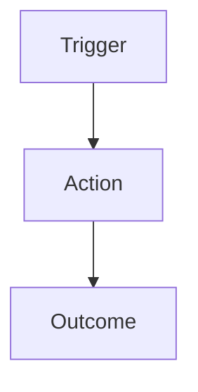

> **Template Note** — Delete this block before publishing.
>
> **Document type:** `spec` | **Diátaxis:** Reference
>
> An Automation Specification is produced by the automation engineer after the
> discovery session. It is the source of truth for what will be built, how it
> will be tested, and what done looks like. The requestor reviews and approves
> it before development begins.
>
> This document is *not* filled out by the requestor. It is derived from the
> intake request and discovery session, then reviewed by the requestor for
> accuracy before engineering begins.
>
> Link the originating Jira Story or Epic in the header. Any scope changes after
> approval require a revision with a new version entry in revision_history.
>
> **Do not use** as an intake form — use `template_automation-request.md` for that.
>
> **Suggested location:** `initiatives/[name]/` or `governance/automation/`
> **File naming:** `spec_automation_[short-title].md`
> **Status lifecycle:** Draft → In Review → Accepted → Retired

# Automation Spec: [Short Title]

_One sentence stating what this automation does and what operational problem it solves._

---

## Linked Request

| Field | Value |
|-------|-------|
| **Jira Story / Epic** | _Link_ |
| **Intake Request** | _Link to request document_ |
| **Requestor** | |
| **Automation Engineer** | |
| **Discovery Session Date** | YYYY-MM-DD |
| **Spec Approved By** | |
| **Approval Date** | YYYY-MM-DD |

---

## Scope Summary

_What this automation does, stated as a single clear boundary.
Use "this automation will" and "this automation will not" to make scope explicit._

**This automation will:**
-
-

**This automation will not:**
-
-

---

## Workflow Description

_Describe the end-to-end workflow: source, transformation, destination._

### Source

_Where does the automation get its input data or trigger?_

| Input | Type | Access Method |
|-------|------|--------------|
| | | |

### Transformation

_What processing, decisions, or actions does the automation perform?_

_Consider a Mermaid flow diagram for complex logic._

### Destination

_Where does output go? What does the automation create, update, or notify?_

| Output | Type | Location / Target |
|--------|------|------------------|
| | | |

---

## Technical Requirements

### Execution Environment

| Requirement | Value |
|-------------|-------|
| **Platform** | _e.g. AAP, standalone Ansible, Python script_ |
| **EE Image** | _e.g. custom EE, default EE_ |
| **Python version** | |
| **Ansible version** | |
| **Required collections / roles** | |
| **Required packages** | |

### Trigger & Schedule

| Field | Value |
|-------|-------|
| **Trigger type** | _Scheduled / Event-driven / On-demand / Webhook_ |
| **Schedule** | _e.g. Daily 02:00 ET / On ITSM ticket creation_ |
| **Estimated runtime** | |

### Credentials & Access

| System | Credential Type | Vault Location |
|--------|----------------|----------------|
| | | |

---

## Integration Points

| System | Direction | Method | Notes |
|--------|-----------|--------|-------|
| | Inbound | | |
| | Outbound | | |

---

## Error Handling & Logging

_How does the automation behave when something goes wrong?_

| Failure Scenario | Behavior | Notification |
|-----------------|----------|--------------|
| _Source unavailable_ | | |
| _Partial failure_ | | |
| _Complete failure_ | | |

**Log destination:** _e.g. AAP job output, Splunk index, file share_
**Retention:** _e.g. 90 days_

---

## Security Considerations

_Access controls, credential handling, data classification, and audit requirements._

-
-

---

## Testing Plan

_How will the automation be validated before production deployment?_

### Test Inventory

_What systems, groups, or environments will be used for testing?_

### Acceptance Tests

_Map directly to the Acceptance Criteria from the intake request._

| # | Test | Expected Result | Pass / Fail |
|---|------|----------------|-------------|
| 1 | | | |
| 2 | | | |

---

## Success Criteria

_Post-implementation metrics. Carried forward from the intake request and
validated after deployment._

| Metric | Target | Measurement Method |
|--------|--------|--------------------|
| | | |

---

## Open Items

- [ ]

---

## Implementation Notes

_Decisions made during discovery or development that affect the implementation.
Record anything that future maintainers would need to know._
