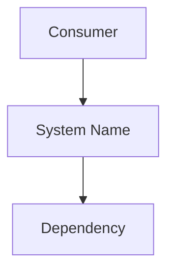
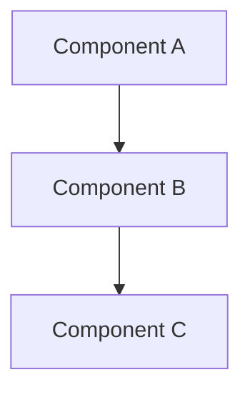

> **Template Note** — Delete this block before publishing.
>
> **Document type:** `sad` | **Diátaxis:** Concept
>
> A System Architecture Document (SAD) provides a comprehensive, end-to-end description
> of a specific platform or system — its components, interactions, deployment topology,
> security posture, and operational characteristics. Use this for significant platforms
> (AAP, Satellite, custom applications) that require a durable reference spanning
> multiple engineering and operations teams.
>
> **Do not use** for domain overviews or initiative summaries — use
> `template_architecture-overview.md` instead. A SAD describes *one system* in depth;
> an overview describes *a domain or initiative*.
>
> **Suggested location:** `docs/systems/`
> **File naming:** `sad_[domain]_[system-name].md`
> **Status lifecycle:** Draft → In Review → Accepted → Retired

# [System Name] System Architecture Document

This document describes the architecture of [System Name], including its logical
structure, component interactions, deployment topology, security posture, and
operational characteristics.

---

## System Overview

_Identify the system: what it is, what business or engineering capability it delivers,
and who depends on it. Two to three sentences._

### Purpose and Scope

_What does this system do? What is explicitly out of scope for this document?_

### Stakeholders

| Role | Organization | Interest |
|------|-------------|----------|
| _System Owner_ | | |
| _Platform Engineering_ | | |
| _Operations_ | | |
| _Security_ | | |

---

## Architectural Context

_Position the system in the broader environment: what does it integrate with,
what does it depend on, and what depends on it?_

### System Context Diagram

_Embed a Mermaid diagram or reference a pre-rendered PNG showing the system
and its external relationships._

### Key Dependencies

| System / Service | Direction | Purpose |
|-----------------|-----------|---------|
| | Inbound | |
| | Outbound | |

---

## Architectural Goals and Constraints

### Goals

_List the primary quality attributes this architecture is designed to achieve:
availability, scalability, security, maintainability, etc._

-
-

### Constraints

_List fixed constraints that shape the architecture: regulatory, organizational,
contractual, or technical non-negotiables._

-
-

---

## Logical Architecture

_Describe the logical structure of the system — components, their responsibilities,
and how they interact. Focus on what, not where._

### Component Overview

_High-level component diagram._

### Component Descriptions

| Component | Responsibility | Technology |
|-----------|---------------|------------|
| | | |

---

## Integration Architecture

_Describe how this system integrates with external systems: APIs, event streams,
shared data stores, authentication providers, and automation pipelines._

### Integration Points

| Integration | Protocol | Direction | Authentication |
|------------|----------|-----------|----------------|
| | | | |

---

## Data Architecture

_Describe the data the system creates, processes, or stores._

### Data Classification

| Data Type | Classification | Storage Location | Retention |
|-----------|---------------|-----------------|-----------|
| | | | |

### Data Flow

_Diagram or description of how data moves through the system._

---

## Security Architecture

_Document the security controls relevant to this system._

### Authentication and Authorization

_How are users and services authenticated? What RBAC or ABAC model is in use?_

### Network Security

_What network zones does this system span? What firewall rules, segmentation,
or zero-trust controls apply?_

### Audit and Logging

_What events are logged? Where do logs go? What is the retention period?_

---

## Deployment Architecture

_Describe the physical and logical deployment topology._

### Infrastructure

| Component | Platform | Location / Cluster | HA Configuration |
|-----------|----------|--------------------|-----------------|
| | | | |

### Deployment Diagram

_Embed a Mermaid diagram or reference a pre-rendered PNG showing deployment topology._

---

## Operational Considerations

### Monitoring and Alerting

_What is monitored? What thresholds trigger alerts? Where do alerts route?_

### Backup and Recovery

_What is backed up, how often, and what is the RTO/RPO?_

### Scaling

_How does this system scale under load? Are there manual or automatic scaling mechanisms?_

---

## Risks and Assumptions

| Risk / Assumption | Type | Impact | Mitigation |
|-------------------|------|--------|------------|
| | Risk | | |
| | Assumption | | |

---

## Open Items

- [ ]

---

## Decision Log

| Date | Decision | Rationale | Owner |
|------|----------|-----------|-------|
| | | | |

---

_Generated from Markdown source using `docx-build`._
